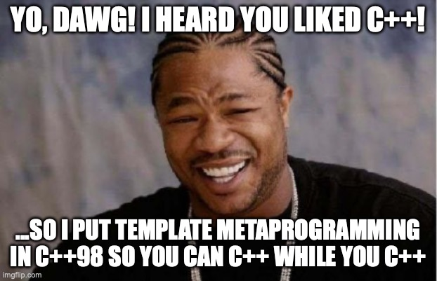

# C++ High Performance (2nd Edition)

## Highlights from Chapter 8 - "Compile-Time Programming"

### Template metaprogramming
Template metaprogramming allows us to write code that transforms itself into regular C++ code.

#
### ...work in progress
